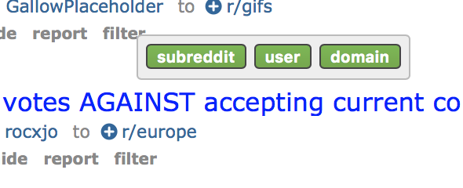

## Tampermonkey Scripts

### Notes
My personal collection of tampermonkey scripts. These can all be used independently of each other, so just grab the ones that sound interesting. I primarily use Safari, and haven't tested any of these in other browsers. If you run into issues, please open an issue.

### facebook-marketplace
Sort facebook marketplace by date

### fakespot
Add fakespot link above buy box on amazon

### outline.js
Open some outgoing links (mostly news) from HN and Reddit using the awesome [outline.com](https://outline.com) service.

### paradoxwikis.js
Achievements page on EU4 wiki is using some new mobile style, so just delete it all and use no style. Tables are usable as-is.

### reddit-filter.js
Adds a filter at end of tagline that has a popup to filter on subreddit, domain, or user (only on r/all). They're stored in the localStorage keys starting with 'filter'. Filtered items must be removed from localStorage manually.



### reddit-load.js
When you scroll to the bottom, load the next page of results. Compatible with reddit-filter.js.

### reddit-nsfw.js
Filter all NSFW tags from appearing on any page

### reddit-override.js
Override Reddit's official window.r functionality that *may* be interesting, I don't really know. The isMobile method stops video pinning though, which is useful.

### reddit-redirect.js
Redirects www calls to old.reddit.com

### script.js
__NOT__ a tampermonkey script, this is the script for a Safari addon

### stylize.js
@deprecated

Allows me to write custom styles for websites matching hosts by string or regex. Not very user friendly and you'd be best off copying the js directly into your tampermonkey extension and ignoring updates.

Replaced with styles in Cascadea.

```javascript
const csses = {
  '((old|www)\.)?reddit\.com$': {
    type: 'regex',
    css: `
      .subreddit {
        border: 1px solid blue;
      }
    `
  },
  'old.reddit.com': {
    type: 'string',
    css: `
      .subreddit {
        border: 1px solid red;
      }
    `
  }
};
```

### xenforo-no-fanwork.js
Remove fanwork discussions from main user forum on sufficientvelocity

### xenforo-no-worm.js
Remove worm stories, except from worm specific forums

### xenforo-popular.js
Hides unpopular stories on spacebattles / sufficientvelocity, so it's easier to go through recently updated and find good stories.

### xenforo-reactions.js
Adds first message reaction score on alternate-history, sufficientvelocity and spacebattles.

### xenforo-search.js
Remove posts from search results, only show threads

### youtube.js
Disable youtube polymer

